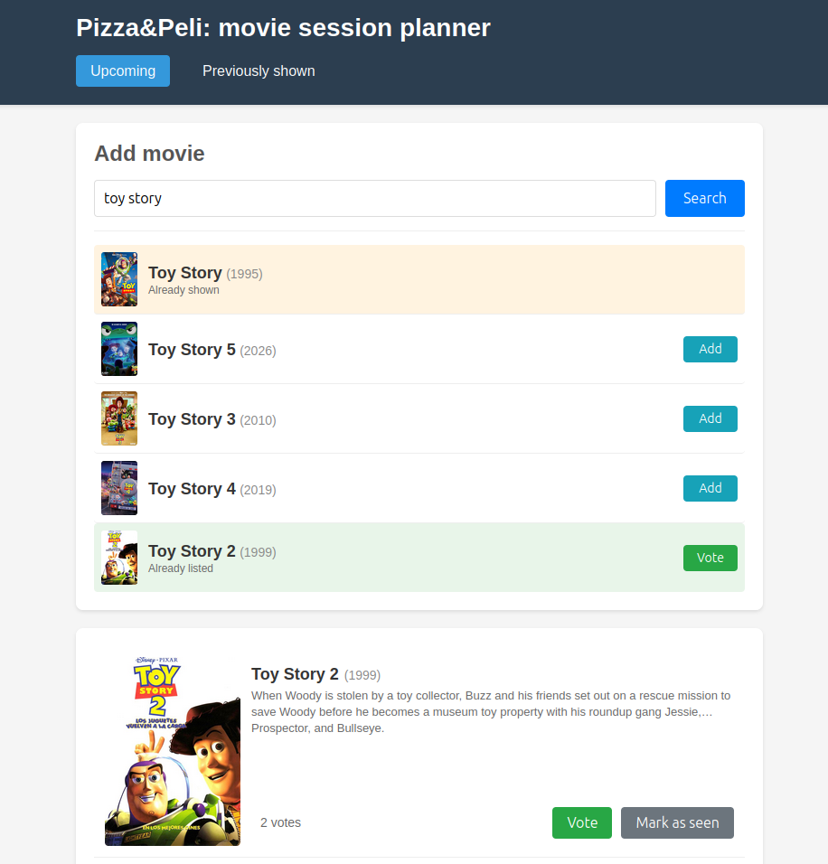

# Pizza y Peli

A simple app to plan and keep track of our home cinema sessions.



Made with Django, and mostly vibecoded with Claude and Cursor. I'm trying to keep a log of the prompts used at [claude_log/prompts.md](claude_log/prompts.md)

Uses https://github.com/tveronesi/imdbinfo to fetch movie metadata from imdb (no API keys required).

## Run with Docker

You'll need Docker: https://docs.docker.com/engine/install/

Build and run:

```
docker compose up --build
```

Then visit http://localhost:8000

This runs with production settings (gunicorn + whitenoise, DEBUG=False).

To stop: `docker compose down`

To run in background:

`docker compose start` or `docker compose up -d`

### Configuration

Some settings can be overriden with environment variables:

- `CUSTOM_DOMAIN`: **required** if you're running on a public server (or you'll get 400 errors). Defaults to localhost.
- `PORT`: defaults to 8000, if unset.
- ... and more. 

Check <.env.example> for the full list. Make a copy to edit to your needs:

`cp .env.example .env`

## Development cookbook

Note: make and use a virtualenv for all commands:

```
python3 -m venv .venv
source .venv/bin/activate
```

Install dependencies: 
```pip install -r requirements.txt```


Run the app:

`python manage.py runserver`


Handle migrations:

```
python manage.py makemigrations # to create migrations for model changes
python mange.py migrate # to apply the changes to the DB
```

Django shell:

`python manage.py shell`


Add new dependencies:

`pip freeze > requirements.txt`

